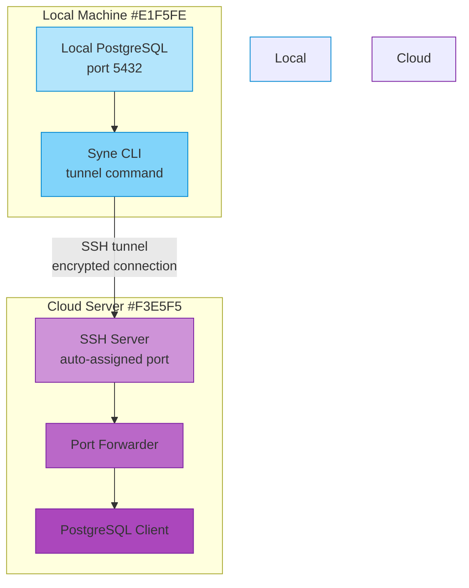

# Syne CLI

A command-line interface tool that provides PostgreSQL operations with authentication.

## Installation

### From GitHub Releases

1. Go to the [Releases](https://github.com/synehq/syne-cli/releases) page
2. Download the appropriate binary for your system:
   - For macOS: `syne-cli_Darwin_x86_64.tar.gz` (Intel) or `syne-cli_Darwin_arm64.tar.gz` (Apple Silicon)
   - For Linux: `syne-cli_Linux_x86_64.tar.gz` (64-bit) or `syne-cli_Linux_arm64.tar.gz` (ARM)
   - For Windows: `syne-cli_Windows_x86_64.zip`
3. Extract the binary to a location in your PATH

### From Source

```bash
go install github.com/synehq/syne-cli@latest
```

## Setup Authentication

1. Run the credentials setup script:
```bash
go run scripts/create_credentials.go <desired-username> <desired-password>
```
This will create a `.env` file with your hashed credentials.

## SSH Tunneling
Connect your local PostgreSQL instance to our cloud server securely through an SSH tunnel.



## Commands

### Login
Test your authentication:
```bash
syne-cli login -u <username> -p <password>
```

### Backup Database
Create a backup of a PostgreSQL database:
```bash
syne-cli backup [flags] \
    -u <username> \
    -p <password> \
    --db-user <postgres-user> \
    --db-password <postgres-password> \
    --db-name <database-name> \
    [--format <format>] \
    [--file <filename>] \
    [--compress] \
    [--data-only]
```

#### Backup Flags
- `--format, -F`: Backup format (default: "custom")
  - `custom`: PostgreSQL custom format (most flexible)
  - `plain`: Plain SQL script
  - `directory`: Directory format
  - `tar`: Tar format
- `--file, -f`: Output file name (defaults to dbname_backup.dump)
- `--compress, -Z`: Enable compression (default: true, not applicable for tar format)
- `--data-only, -D`: Backup only data without schema

### Restore Database
Restore a PostgreSQL database from a backup:
```bash
syne-cli restore [flags] \
    -u <username> \
    -p <password> \
    --db-user <postgres-user> \
    --db-password <postgres-password> \
    --db-name <database-name> \
    --file <backup-file> \
    [--clean] \
    [--single-transaction] \
    [--data-only]
```

#### Restore Flags
- `--file, -f`: Input backup file (required)
- `--clean, -c`: Clean (drop) database objects before recreating
- `--single-transaction, -s`: Wrap restore operation in a single transaction
- `--data-only, -D`: Restore only data without schema

The restore command automatically detects the backup format from the file extension:
- `.sql`: Plain SQL script
- `.dump`: Custom format
- `.dir`: Directory format
- `.tar`: Tar format

### SSH Tunneling
Create a secure SSH tunnel to allow cloud server to connect to your local PostgreSQL instance:
```bash
syne-cli tunnel [flags] \
    -u <username> \
    -p <password> \
    --ssh-host <hostname> \
    --ssh-user <ssh-username> \
    --remote-port <port>
```

#### Tunnel Flags
- `--ssh-host`: SSH server hostname (required)
- `--ssh-port`: SSH server port (default: "22")
- `--ssh-user`: SSH username (required)
- `--ssh-key`: Path to SSH private key (defaults to ~/.ssh/id_rsa)
- `--local-port`: Local PostgreSQL port to forward (default: "5432")
- `--remote-host`: Remote host for tunnel endpoint (default: "localhost")
- `--remote-port`: Remote port on cloud server (required)
- `--bind`: Local address to bind to (default: "localhost")

### Copy Files to PostgreSQL
Copy files from a folder to a PostgreSQL table:
```bash
syne-cli copy <folder-path> <table-name> \
    -u <username> \
    -p <password> \
    --db-user <postgres-user> \
    --db-password <postgres-password> \
    --db-name <database-name> \
    [--host <host>] \
    [--port <port>] \
    [--ssl-mode <ssl-mode>]
```

#### Optional Flags
- `--host`: PostgreSQL host (default: "localhost")
- `--port`: PostgreSQL port (default: "5432")
- `--ssl-mode`: PostgreSQL SSL mode (default: "disable")

## Example Usage

### Backup and Restore Examples

1. Create a compressed custom-format backup with schema and data:
```bash
syne-cli backup \
    -u admin \
    -p secretpassword \
    --db-user postgres \
    --db-password dbpass \
    --db-name mydb \
    --file mydb_backup.dump
```

2. Create a data-only backup in plain SQL format:
```bash
syne-cli backup \
    -u admin \
    -p secretpassword \
    --db-user postgres \
    --db-password dbpass \
    --db-name mydb \
    --format plain \
    --data-only \
    --file mydb_data.sql
```

3. Restore from a backup with clean option and single transaction:
```bash
syne-cli restore \
    -u admin \
    -p secretpassword \
    --db-user postgres \
    --db-password dbpass \
    --db-name mydb \
    --file mydb_backup.dump \
    --clean \
    --single-transaction
```

### Tunnel Example

1. Start an SSH tunnel to the cloud server:
```bash
syne-cli tunnel \
    -u admin \
    -p secretpassword \
    --ssh-host cloud.example.com \
    --ssh-user tunnel \
    --remote-port 5432
```

This will:
- Forward your local PostgreSQL port (5432) to the cloud server
- Use your default SSH key (~/.ssh/id_rsa)
- Keep running until you press Ctrl+C to stop

2. In a separate terminal, you can now use other commands that will work through the tunnel:
```bash
# Backup through the tunnel
syne-cli backup \
    -u admin \
    -p secretpassword \
    --file mydb_backup.dump

# Import data through the tunnel
syne-cli copy ./examples users \
    -u admin \
    -p secretpassword \
    --db-user postgres \
    --db-password dbpass \
    --db-name mydb
```

### CSV Import Examples

1. First set up your CLI credentials:
```bash
go run scripts/create_credentials.go admin secretpassword
```

2. Test the login:
```bash
syne-cli login -u admin -p secretpassword
```

3. Copy CSV files from a folder to PostgreSQL (example using provided sample):
```bash
# The CLI will automatically create the table with appropriate column types:
syne-cli copy ./examples users \
    -u admin \
    -p secretpassword \
    --db-user postgres \
    --db-password dbpass \
    --db-name mydb
```

## Notes

### SSH Tunneling Requirements
- SSH access to the cloud server
- SSH key-based authentication (password auth not supported)
- Local PostgreSQL instance running
- Required ports open on cloud server
- Proper SSH key permissions (600 on Unix-like systems)


### Environment Variables
The CLI uses the following PostgreSQL environment variables:
- `PGHOST`: Database server host
- `PGPORT`: Database server port
- `PGUSER`: PostgreSQL username
- `PGPASSWORD`: PostgreSQL password
- `PGDATABASE`: Database name to connect to
- `PGSSLMODE`: SSL mode (disable, require, verify-ca, verify-full)

These can be set in your shell or provided via a .env file.

- The copy command expects CSV files with headers in the specified folder
- The headers from the first row will be used as column names
- The data types will be automatically inferred from the second row
- Supported data types:
  - INTEGER for whole numbers
  - NUMERIC for decimal numbers
  - DATE for dates (YYYY-MM-DD format)
  - TIMESTAMP for date-times
  - BOOLEAN for true/false values
  - TEXT for everything else
- Authentication is required for all operations
- The CLI uses environment variables for storing authentication credentials
- PostgreSQL connection details are provided via command-line flags

## Limitations

1. CSV Format Requirements:
   - Files must have headers as the first row
   - All CSV files in a folder must have the same header structure
   - Headers must be valid PostgreSQL column names (no spaces, special characters)
   - Empty values are treated as NULL

2. SSH Tunnel Security:
   - Only key-based authentication is supported
   - Tunnel connections are encrypted end-to-end
   - Local PostgreSQL instance remains behind your firewall
   - Cloud server can only access specified ports
   - Automatic tunnel shutdown on program termination

3. Backup Formats:
   - Custom format (.dump) is recommended for most cases as it's compressed and flexible
   - Plain SQL (.sql) is useful for human-readable backups or cross-version compatibility
   - Directory format (.dir) allows parallel restore and selective table restore
   - Tar format (.tar) is similar to custom but more standardized

3. Type Inference:
   - Types are inferred from the first data row only
   - Subsequent rows with different formats may cause import errors
   - All numeric values in a column must be consistent (all INTEGER or all NUMERIC)
   - Dates must be in YYYY-MM-DD format
   - Timestamps must be in YYYY-MM-DD[T ]HH:MM:SS format
   - Boolean values accept: true/false, t/f, yes/no (case insensitive)

3. Table Management:
   - Cannot modify existing tables (table must not exist)
   - No support for primary keys or indexes (must be added manually)
   - No support for custom column types or constraints

4. Performance:
   - All files are processed sequentially
   - Entire CSV file is loaded into memory during type inference
   - Large files may consume significant memory

5. Error Handling:
   - Entire transaction is rolled back if any row fails
   - No partial imports within a file
   - No resume capability for failed imports

## Release Process

To create a new release:

1. Tag the release:
```bash
git tag -a v1.0.0 -m "Release v1.0.0"
git push origin v1.0.0
```

2. GitHub Actions will automatically:
   - Build binaries for all supported platforms
   - Create a GitHub release
   - Upload the binaries as release assets
